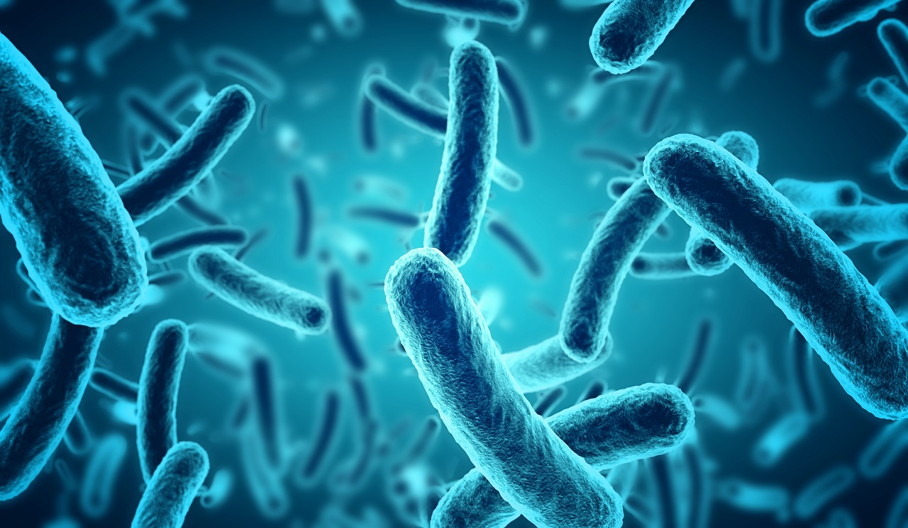

# Belly Button Biodiversity

[`image source: https://study-z.net/img/is/iStock-628978952.jpg`](https://study-z.net/img/is/iStock-628978952.jpg)

## Background

## Plotly
### Barchart

To create a horizontal bar chart and display the top 10 OTUs found in each subject, `sample.json` is read by using the D3 library. The values plotted on the bar chart is from `sample_values`, the labels are from `otu_ids` and the hovertext of the chart is from `otu_labels`. The barchart will look like below:

### Bubble Chart

A bubble chart is created to display `sample_values` of each individual. In the chart the marker size descrine `sample_values`. Marker colors are defined by `otu_ids` and the text values are defined by `otu_labels`. The bubble chart will look like below:

### Demographic Information

A card is created to display demographic information of the sample. 

### Gauge Chart

A gauge chart is created to display weekly washing frequency for the individual, the gauge values are in the range of 0 to 9 and the chart will be updated when a new sample is selected.

### Overal Dashboard

## Deployment

The final application is deployed by using GitHub Pages for public viewing. 
[Click here to view and interact with the site](https://kesavanh.github.io/plotly-challenge/index.html)

and look like below:

